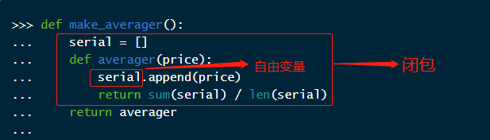

+++
title = "Python 中的函数装饰器和闭包"
date = "2021-02-01"
[taxonomies]
categories = ["Python"]
tags = ["python-decorator", "python-closure"]
+++

Python 中的函数装饰器可以被用于增强方法的某些行为，如果想自己实现装饰器，则必须了解闭包的概念。

本文也是《流畅的 Python》第七章的学习笔记。

<!-- more -->

## 装饰器的基本概念

装饰器是一个可调用对象，它的参数是另一个函数，称为**被装饰函数**。装饰器可以修改这个函数再将其返回，也可以将其替换为另一个函数或者可调用对象。

例如：有个名为 `decorate` 的装饰器：

```python
@decorate
def target():
    print('running target()')
```

上述代码的写法和以下写法的效果是一样的：

```python
def target():
    print('running target()')
    
target = decorate(target)
```

但是，它们返回的 `target` 不一定是原来的那个 `target` 函数，例如下面这个例子：

```bash
>>> def deco(func):
...     def inner():
...         print('running inner()')
...     return inner
...
>>> @deco
... def target():
...     print('running target()')
...
>>> target()
running inner()
>>> target
<function deco.<locals>.inner at 0x0000013D88563040>
```

可以看到，调用 `target` 函数执行的是 `inner` 函数，这里的 `target` 实际上是 `inner` 的引用。

## 何时执行装饰器

装饰器的另一个关键特性是，它们在被装饰函数定义时立即执行，这通常是发生在导入模块的时候。

例如下面的这个模块：`registration.py`

```python
# 存储被装饰器 @register 装饰的函数
registry = []


# 装饰器
def register(func):
    print(f"注册函数 -> {func}")
    # 记录被装饰的函数
    registry.append(func)
    return func


@register
def f1():
    print("执行 f1()")


@register
def f2():
    print("执行 f2()")


def f3():
    print("执行 f3()")


if __name__ == "__main__":
    print("执行主函数")
    print("registry -> ", registry)
    f1()
    f2()
    f3()
```

现在我们在命令行执行这个脚本：

```bash
$ python registration.py
注册函数 -> <function f1 at 0x000001F6FC8320D0>
注册函数 -> <function f2 at 0x000001F6FC832160>
执行主函数
registry ->  [<function f1 at 0x000001F6FC8320D0>, <function f2 at 0x000001F6FC832160>]
执行 f1()
执行 f2()
执行 f3()
```

这里我们可以看到，在主函数执行之前，`register`  已经执行了两次。加载模块后，`registry` 中已经有两个被装饰函数的引用：`f1` 和 `f2`。不过这两个函数以及 `f3`  都是在脚本中明确调用后才开始执行的。

如果只是单纯的导入 `registration.py` 模块而不运行：

```python
>>> import registration
注册函数 -> <function f1 at 0x0000022670012280>
注册函数 -> <function f2 at 0x0000022670012310>
```

查看 `registry` 中的值：

```python
>>> registration.registry
[<function f1 at 0x0000022670012280>, <function f2 at 0x0000022670012310>]
```

这个例子主要说明：**装饰器在导入模块时立即执行，而被装饰的函数只有在明确调用时才运行**。这也突出了 Python 中导入时和运行时这个两个概念的区别。

在装饰器的实际使用中，有两点和示例是不同的：

- 示例中装饰器和被装饰函数在同一个模块中。实际使用中，装饰器通常在一个单独的模块中定义，然后再应用到其它模块的函数上。
- 示例中 `register`  装饰器返回的函数和传入的参数相同。实际使用中，装饰器会在内部定义一个新函数，然后将其返回。

装饰器内部定义并返回新函数的做法需要靠闭包才能正常运作。为了理解闭包，则必须先了解 Python 中的变量作用域。

## 变量作用域的规则

我们来看下面这个例子，一个函数读取一个局部变量 `a`，一个全局变量 `b`。

```bash
>>> def f1(a):
...     print(a)
...     print(b)
...
>>> f1(3)
3
Traceback (most recent call last):
  File "<stdin>", line 1, in <module>
  File "<stdin>", line 3, in f1
NameError: name 'b' is not defined
```

出现错误并不奇怪。如果我们先给 `b` 赋值，再调用  `f1`，那就不会出错了：

```python
>>> b = 1
>>> f1(3)
3
1
```

现在，我们来看一个不寻常的例子：

```bash
>>> b = 1
>>> def f2(a):
...     print(a)
...     print(b)
...     b = 2
...
>>> f2(3)
3
Traceback (most recent call last):
  File "<stdin>", line 1, in <module>
  File "<stdin>", line 3, in f2
UnboundLocalError: local variable 'b' referenced before assignment
```

这里，`f2` 函数的前两行和 `f1` 相同，然后再给 `b` 赋值。可是，在赋值之前，第二个 `print` 失败了。这是因为**Python 在编译函数的定义体时，发现在函数中有给 `b` 赋值的语句，因此判断它是局部变量**。而在上述示例中，当我们打印局部变量 `b` 时，它并没有被绑定值，故而报错。

> Python 不要求声明变量，但是会把在函数定义体中赋值的变量当成局部变量。

如果想把上述示例中的 `b` 看成全局变量，则需要使用 `global` 声明：

```bash
>>> b = 1
>>> def f3(a):
...     global b
...     print(a)
...     print(b)
...     b = 2
...
>>> f3(3)
3
1
>>> b
2
>>> f3(3)
3
2
```

## 闭包

闭包是指**延伸了作用域的函数，其中包含了函数定义体中的引用，以及不在定义体中定义的非全局变量**。

我们通过以下示例来理解这句话。

假设我们有这种需求，计算某个商品在整个历史中的平均收盘价格（商品每天的价格会变化）。例如：

```python
>>> avg(10)
10.0
>>> avg(11)
10.5
>>> avg(12)
11.0
```

那么如何获取 `avg` 函数？历史收盘价格又是如何保存的？

我们可以用一个类来实现：

```python
class Averager:
    def __init__(self):
        self.serial = []

    def __call__(self, price):
        self.serial.append(price)
        return sum(self.serial) / len(self.serial)
```

`Averager` 的实例是一个可调用对象。

```python
>>> avg = Averager()
>>> avg(10)
10.0
>>> avg(11)
10.5
>>> avg(12)
11.0
```

也可以使用一个函数来实现：

```bash
>>> def make_averager():
...     serial = []
...     def averager(price):
...         serial.append(price)
...         return sum(serial) / len(serial)
...     return averager
...
>>> avg = make_averager()
>>> avg(10)
10.0
>>> avg(11)
10.5
>>> avg(12)
11.0
```

第一种写法很明显的可以看到，所有历史收盘价均保存在实例变量 `self.serial` 中。

第二种写法我们要好好的分析一下：`serial` 是 `make_averager` 的局部变量，但是当我们调用 `avg(10)` 时，`make_averager` 函数已经返回了，它的作用域不是应该消失了吗？

实际上，在 `averager` 函数中，`serial` 是**自由变量**（未在本地作用域中绑定的变量）。如下图所示：



我们可以在 `averager` 返回对象的 `__code__` 属性中查看它的局部变量和自由变量的名字。

```bash
>>> avg.__code__.co_varnames
('price',)
>>> avg.__code__.co_freevars
('serial',)
```

自由变量 `serial` 绑定的值存放在 `avg` 对象的 `__closure__` 属性中，它是一个元组，里面的元素是 `cell` 对象，它的 `cell_contents` 属性保存实际的值：

```bash
>>> avg.__closure__
(<cell at 0x000002266FF99430: list object at 0x00000226702841C0>,)
>>> avg.__closure__[0].cell_contents
[10, 11, 12]
```

综上所述，闭包是一种函数，它会保留定义函数时存在的自由变量的绑定值，这样在我们调用这个函数时，即使作用域不在了，仍然可以使用这些绑定的值。

> 注意：
>
> 只有嵌套在其它函数中的函数才可能需要处理不在全局作用域中的外部变量。

## `nonlocal` 声明

前面的 `make_averager` 方法的效率并不高，我们可以只保存当前的总值和元素个数，再使用它们计算平均值。下面是我们更改后的函数体：

```bash
>>> def make_averager():
...     count = total = 0
...     def averager(price):
...         count += 1
...         total += price
...         return total / count
...     return averager
```

但是这个写法实际上是有问题的，我们先运行再分析：

```bash
>>> avg = make_averager()
>>> avg(10)
Traceback (most recent call last):
  File "<stdin>", line 1, in <module>
  File "<stdin>", line 4, in averager
UnboundLocalError: local variable 'count' referenced before assignment
```

这里 `count` 被当成 `averager` 的局部变量，而不是我们期望的自由变量。这是因为 `count += 1` 相当于 `count = count + 1`。因此，我们在 `averager` 函数体中实际包含了给 `count` 赋值的操作，这就把 `count` 变成局部变量。`total` 也有这个问题。

为了解决这个问题，python 引入了 `nonlocal` 关键字，用于声明自由变量。使用 `nonlocal` 修改上述的例子：

```bash
>>> def make_averager():
...     count = total = 0
...     def averager(price):
...         nonlocal count, total
...         count += 1
...         total += price
...         return total / count
...     return averager
...
>>> avg = make_averager()
>>> avg(10)
10.0
>>> avg(11)
10.5
>>> avg(12)
11.0
```

## 叠放装饰器

如果我们把 `@d1` 和 `@d2` 两个装饰器应用到同一个函数 `f()` 上，实际相当于 `f = d1(d2(f))`。

也就是说，下属代码：

```python
@d1
@d2
def f():
	pass
```

等同于：

```python
def f():
	pass


f = d1(d2(f))
```

## 参数化装饰器

Python 会把被装饰的参数作为第一个参数传递给装饰器函数，那么如何让装饰器接受其它的参数呢？这里我们需要定义一个装饰器工厂函数，返回真正的装饰器函数。

以本文开头的 `register` 装饰器为例，我们为它添加一个 `active` 参数，如果置为 `False`，那就不注册这个函数。

```python
registry = []


def register(active=True):
    def decorate(func):
        if active:
            print(f"注册函数 -> {func}")
            # 记录被装饰的函数
            registry.append(func)
        return func

    return decorate


@register()
def f1():
    print("执行 f1")


@register(active=False)
def f2():
    print("执行 f2")
```

现在我们导入这个模块：

```bash
>>> import registration
注册函数 -> <function f1 at 0x0000016D80402280>
```

可以看到只注册了 `f1` 函数。

## 实现一个简单的装饰器

这里我们使用嵌套函数实现一个简单的装饰器：计算被装饰函数执行的耗时，并将函数名、参数和执行的结果打印出来。

```python
import time


def clock(func):
    def clocked(*args):
        start_time = time.perf_counter()
        result = func(*args)
        cost = time.perf_counter() - start_time
        print(
            "[%.2f] %s(%s) -> %r" % (cost, func.__name__, list(map(repr, args)), result)
        )
        return result

    return clocked
```

下面我们来试试这个装饰器：

```bash
>>> @clock
... def factorial(n):
...     # 计算 n 的阶乘
...     return 1 if n < 2 else n * factorial(n - 1)
>>> 
>>> factorial(6)
[0.00] factorial(['1']) -> 1
[0.00] factorial(['2']) -> 2
[0.00] factorial(['3']) -> 6
[0.00] factorial(['4']) -> 24
[0.00] factorial(['5']) -> 120
[0.00] factorial(['6']) -> 720
720
```

具体来分析一下，这里 `factorial` 作为 `func` 参数传递给 `clock` 函数，然后 `clock` 函数返回 `clocked` 函数，Python 解释器会把 `clocked` 赋值给 `factorial`。所以，如果我们查看 `factorial` 的 `__name__` 属性，会发现它的值是 `clocked` 而不是 `factorial`。

```bash
>>> factorial.__name__
'clocked'
```

所以，`factorial` 保存的是 `clocked` 的引用，每次调用 `factorial` 实际上都是在调用 `clocked` 函数。

我们也可以使用 `functools.wraps` 装饰器把 `func` 的一些属性复制到 `clocked` 函数上，例如：`__name__` 和 `__doc__`：

```bash
def clock(func):
    @functools.wraps(func)
    def clocked(*args):
        start_time = time.perf_counter()
        result = func(*args)
        cost = time.perf_counter() - start_time
        print(
            "[%.2f] %s(%s) -> %r" % (cost, func.__name__, list(map(repr, args)), result)
        )
        return result

    return clocked
>>> 
>>> @clock
... def factorial(n):
...     return 1 if n < 2 else n * factorial(n - 1)
>>> 
>>> factorial.__name__
'factorial'
```

## 标准库中的装饰器

### 使用 `functools.lru_cache` 做备忘

`functools.lru_cache` 会把耗时的函数的结果保存起来，避免传入相同的参数时的重复计算。`lru` 的意思是 *Least Recently Used*，表示缓存不会无限增长，一段时间不用的缓存条目会被丢弃。

`lru_cache` 非常适合计算第 n 个斐波那契数这样的慢速递归函数。

我们来看看不使用 `lru_cache` 时的情况：

```bash
>>> @clock
... def fibonacci(n):
...     return n if n < 2 else fibonacci(n - 2) + fibonacci(n - 1)
...
>>> fibonacci(6)
[0.00000040] fibonacci(['0']) -> 0
[0.00000060] fibonacci(['1']) -> 1
[0.00030500] fibonacci(['2']) -> 1
[0.00000030] fibonacci(['1']) -> 1
[0.00000040] fibonacci(['0']) -> 0
[0.00000060] fibonacci(['1']) -> 1
[0.00042110] fibonacci(['2']) -> 1
[0.00074440] fibonacci(['3']) -> 2
[0.00128530] fibonacci(['4']) -> 3
[0.00000020] fibonacci(['1']) -> 1
[0.00000030] fibonacci(['0']) -> 0
[0.00000050] fibonacci(['1']) -> 1
[0.00035500] fibonacci(['2']) -> 1
[0.00055270] fibonacci(['3']) -> 2
[0.00000030] fibonacci(['0']) -> 0
[0.00000060] fibonacci(['1']) -> 1
[0.00041220] fibonacci(['2']) -> 1
[0.00000040] fibonacci(['1']) -> 1
[0.00000040] fibonacci(['0']) -> 0
[0.00000050] fibonacci(['1']) -> 1
[0.00032410] fibonacci(['2']) -> 1
[0.00061420] fibonacci(['3']) -> 2
[0.00122760] fibonacci(['4']) -> 3
[0.00206850] fibonacci(['5']) -> 5
[0.00352630] fibonacci(['6']) -> 8
8
```

这种方式有很多重复的计算，例如 `fibonacci(['1'])`  执行了 8 次，`fibonacci(['2'])`  执行了 5 次等等。

现在我们使用 `functools.lru_cache` 优化一下：

```bash
>>> @functools.lru_cache
... @clock
... def fibonacci(n):
...     return n if n < 2 else fibonacci(n - 2) + fibonacci(n - 1)
...
>>> fibonacci(6)
[0.00000060] fibonacci(['0']) -> 0
[0.00000070] fibonacci(['1']) -> 1
[0.00106320] fibonacci(['2']) -> 1
[0.00000080] fibonacci(['3']) -> 2
[0.00132790] fibonacci(['4']) -> 3
[0.00000060] fibonacci(['5']) -> 5
[0.00159670] fibonacci(['6']) -> 8
8
```

可以看到节省了一般的执行时间，并且 n 的每个值只调用了一次函数。

在执行 `fibonacci(30)` 时，如果使用未优化的版本需要 141 秒，使用优化后的版本只需要 0.002 秒。

除了优化递归算法之外，`lru_cache` 在从 WEB 获取信息的应用中也能发挥巨大作用。

`lru_cache` 还有两个可选参数：

```python
def lru_cache(maxsize=128, typed=False):
```

- `maxsize`：最多可存储的调用结果的个数。缓存满了之后，旧的结果被丢弃。为了获取最佳的性能，`maxsize` 应该设置为 2 的幂。
- `typed`：如果置为 `True`，会把不同参数类型得到的结果分开保存。例如：`f(3.0)` 和 `f(3)` 会被当成不同的调用。

### 单分派泛函数

假设我们现在开发一个调试 WEB 应用的工具：生成 HTML，显示不同类型的 Python 对象。

我们可以这样编写一个函数：

```python
import html


def htmlize(obj):
    content = html.escape(repr(obj))
    return f"<pre>{content}</pre>"
```

现在我们需要做一些拓展，让它使用特别的方式显示某些特定类型：

- `str`：把字符串内部的 `\n` 替换为 `<br>\n`，并且使用 `<p>` 替换 `<pre>`；

- `int`：以十进制和十六进制显示数字；
- `list`：显示一个 HTML 列表，根据各个元素的类型格式化；

最常用的方式就是写 `if...elif..else` 判断：

```python
import numbers
from collections.abc import MutableSequence


def htmlize(obj):
    if isinstance(obj, str):
        content = obj.replace("\n", "<br>\n")
        return f"<p>{content}</p>"
    elif isinstance(obj, numbers.Integral):
        content = f"{obj} ({hex(obj)})"
        return f"<pre>{content}</pre>"
    elif isinstance(obj, MutableSequence):
        content = "</li>\n<li>".join(htmlize(item) for item in obj)
        return "<ul>\n<li>" + content + "</li>\n</ul>"
    else:
        content = f"<pre>{obj}</pre>"
        return content
```

如果想添加新的类型判断，只会将函数越写越长，并且各个类型之间耦合度较高，不利于维护。

Python 3.4 新增的 `functools.singledispatch` 装饰器可以将整个方案拆分成多个模块。

```python
import numbers
from collections.abc import MutableSequence
from functools import singledispatch


@singledispatch
def htmlize(obj):
    content = f"<pre>{obj}</pre>"
    return content


@htmlize.register(str)
def _(text):
    content = text.replace("\n", "<br>\n")
    return f"<p>{content}</p>"


@htmlize.register(numbers.Integral)
def _(num):
    content = f"{num} ({hex(num)})"
    return f"<pre>{content}</pre>"


@htmlize.register(MutableSequence)
def _(seq):
    content = "</li>\n<li>".join(htmlize(item) for item in seq)
    return "<ul>\n<li>" + content + "</li>\n</ul>"
```

这里我们为每一个需要特殊处理的类型都定义另一个专门的函数。

> 关于`functools.singledispatch` 的更详细的文档参考：<https://www.python.org/dev/peps/pep-0443/>。