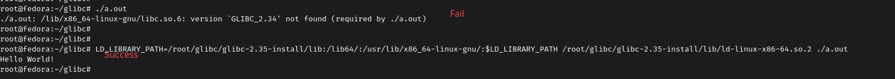

+++
title = "/lib/x86_64-linux-gnu/libc.so.6: version `GLIBC_2.34' not found"
date = "2025-11-25"
[taxonomies]
categories = ["C/C++"]
tags = ["glibc"]
+++

在 Ubuntu 20.04 中执行 22.04 编译的程序，可能会触发 GLIBC 的版本问题。

主要原因是 Ubuntu 22.04 默认的 glibc 版本是 2.35，Ubuntu 20.04 最新的版本是 2.31。

<!-- more -->

通过在 Ubuntu 20.04 中安装指定的 glibc 版本，并只针对特定程序生效。

> 本文以下操作涉及 Docker（Podman） 镜像 `docker.io/library/buildpack-deps` 的 `20.04` 和 `22.04`。

在独立目录安装 glibc

```bash
$ mkdir $HOME/glibc/ && cd $HOME/glibc
$ wget http://ftp.gnu.org/gnu/libc/glibc-2.35.tar.gz
$ tar -xvzf glibc-2.35.tar.gz
$ mkdir build
$ mkdir glibc-2.35-install
$ cd build
$ ~/glibc/glibc-2.35/configure --prefix=$HOME/glibc/glibc-2.35-install
```

> 这里可能会遇到错误： `These critical programs are missing or too old: gawk bison`。
>
> 执行以下操作：
>
> ```bash
> $ apt update
> $ apt install gawk bison
> ```

继续执行：

```bash
$ make
$ make install
```

最后，在执行程序前添加前缀 `LD_LIBRARY_PATH=/root/glibc/glibc-2.35-install/lib:/lib64/:/usr/lib/x86_64-linux-gnu/:$LD_LIBRARY_PATH /root/glibc/glibc-2.35-install/lib/ld-linux-x86-64.so.2`。

